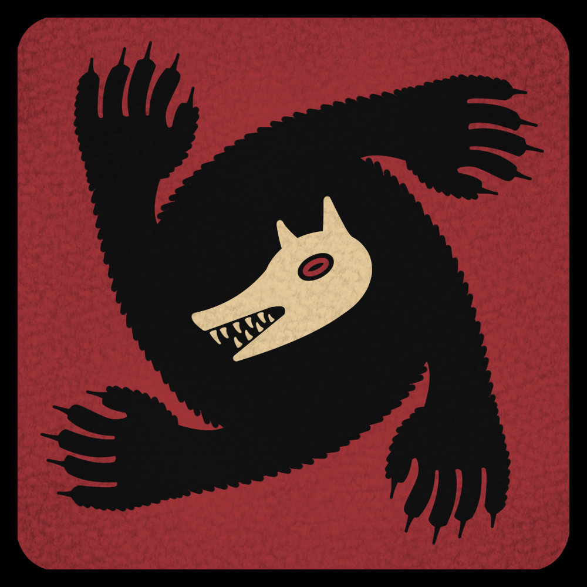
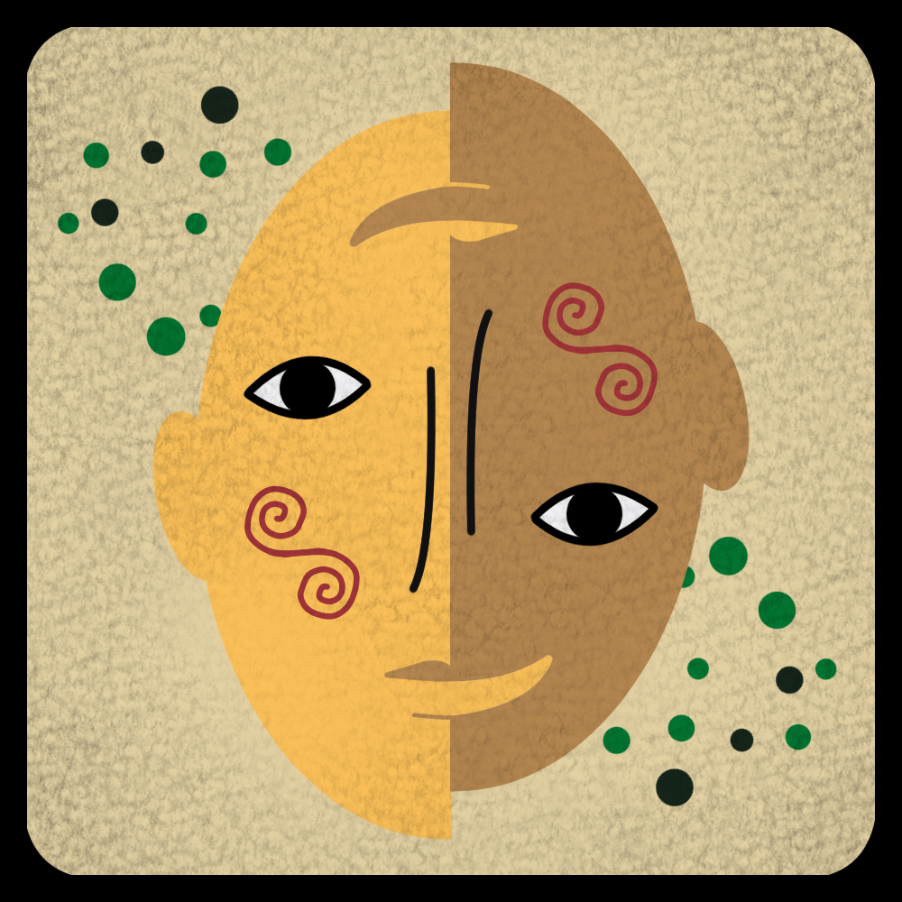
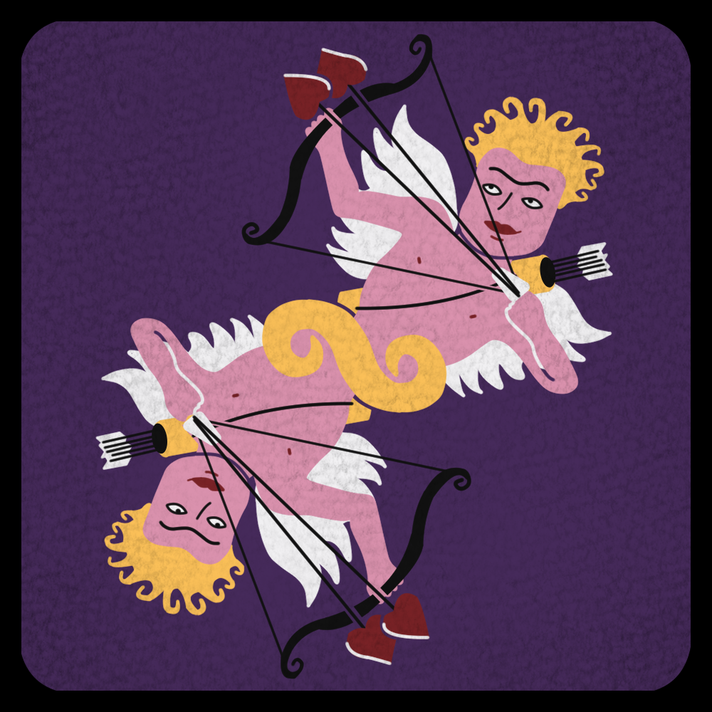

# Werewolves on the Clocktower

### A hidden-role village mystery made for crowded rooms, whispered alliances, and difficult accusations

  
  &nbsp;&nbsp;
  
  &nbsp;&nbsp;
  

*A private, non-commercial companion for an original social-deduction game inspired by* Werewolf of the Miller's Hollow *and selected ideas from* Blood on the Clocktower.

---

## Welcome to the village of Freebourough

By day, everyone is free to move, bargain, accuse, mislead, and search for the few people they might be able to trust. When the village gathers for the Tribunal, suspicions become public, defendants must answer for themselves, and a vote may end a life.

By night, the village closes its eyes. Werewolves choose their victims, strange powers awaken, hidden loyalties shift, and the Game Master quietly guides each character through the consequences.

**Werewolves on the Clocktower** expands the familiar Werewolf formula into a larger, more involved game with more than forty distinct characters. Every player receives something meaningful to do, bluffing remains understandable for newcomers, and death does not remove anyone from the story: fallen players return as ghosts and continue taking part in the village.

## What the companion does

The project is a web-based assistant for running the game around a real table.

One Game Master creates a room and shares its code or QR link. Players join from their phones and privately receive only the information meant for them, while the Game Master follows the table state, seats players, distributes roles, advances through day, Tribunal, and night, and sends character-specific revelations when the story calls for them.

It is designed to protect the secrecy that makes the game exciting while reducing the amount of information the Game Master must hold in their head. The long-term ambition is to make even large and complicated sessions feel smooth enough to run with a single narrator.

## The spirit of the game

This version was created for groups who enjoy conversation more than elimination. Its focus is on:

- **Communication and bluffing:** players may reveal the truth, invent a role, trade information, form alliances, or set traps.
- **A dramatic public Tribunal:** accusations have structure, defendants have a chance to speak, and the whole village decides what happens next.
- **Characters with consequences:** information, poison, protection, love, betrayal, imitation, resurrection, and changing allegiances can reshape a game.
- **Participation after death:** ghosts remain part of the village instead of spending the rest of the session outside the game.
- **A welcoming learning curve:** the rules remain recognisably Werewolf, even as the character interactions grow deeper.

## Languages and rulebooks

The game is currently written for:

- European Portuguese: [read the rulebook](Rulebook_PT.md) or [open the living reference document](https://docs.google.com/document/d/1aV9II9br_8ln4zrA7wgHRByBLqyb8EzkOqc2ltHGCes/edit?usp=sharing)
- French: [read the rulebook](Rulebook_FR.md) or [open the living reference document](https://docs.google.com/document/d/1Jd6N6Us3eo_LdNMcFmwEd3A5IbOAB332adSVViu7Na0/edit?tab=t.0#heading=h.dy2z3kn1r3as)

English rules and interface text may be added in the future.

## Project status

This is an evolving personal project shaped through real games, corrections, and playtesting. Some character actions are deliberately mediated by the Game Master, and the rules may continue to change as unusual interactions are discovered around the table.

For setup, architecture, local play, testing, database maintenance, and deployment, see the [development and maintenance guide](docs/development.md). Current ideas and playtest priorities live in [ROADMAP.md](ROADMAP.md).

## Share your experience

Thoughts, balance suggestions, edge cases, and stories from the table are welcome. They can help refine both the rules and the companion.

You can also rank the characters using the [official community tier list](https://tiermaker.com/create/werewolves-on-the-clocktower---official-teir-list-17406677).

To find the creator elsewhere, visit [@an_jo_morto](https://linktr.ee/anjomorto).

## Art and credits

All character art is digitally hand-drawn by **L_PT_1463**. The collection combines original designs with reinterpretations of cards from *Werewolf of the Miller's Hollow*, informed by references from [Loups-Garous en Ligne](https://www.loups-garous-en-ligne.com/) and the [Wiki Loup-Garou](https://loupgarou.fandom.com/fr/wiki/Wiki_Loup-Garou).

The cards were redrawn in a unified personal style so the full cast feels like it belongs to the same village, while remaining familiar enough for players arriving from the classic game.

## AI transparency

The game design, character interactions, priorities, corrections, and creative direction are human-led. AI-assisted tools have been used during implementation: the application began as a Lovable project and later moved to a repository-based workflow with Codex assistance, allowing the maintainer to inspect, change, and correct the code directly.

All artwork is human-created. This project does not use AI-generated art and does not intend to introduce it.

## Disclaimer

This project is provided as-is for private, non-commercial use. Use or modification is at your own risk.
