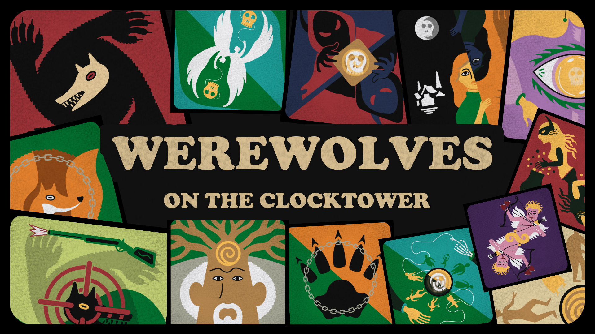
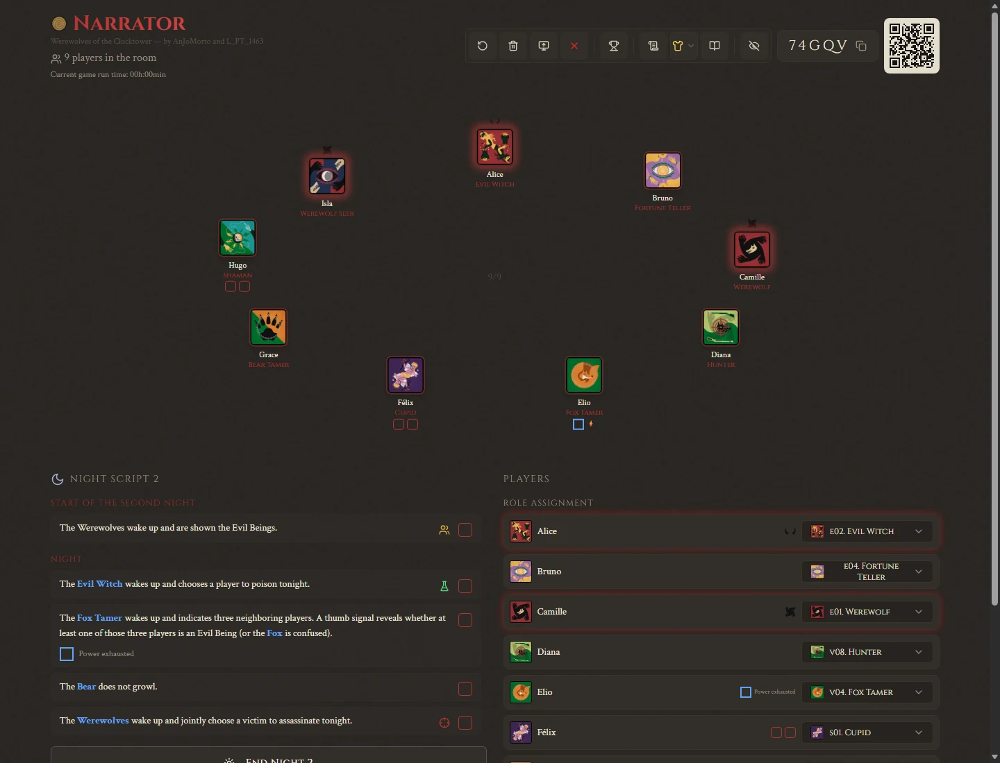
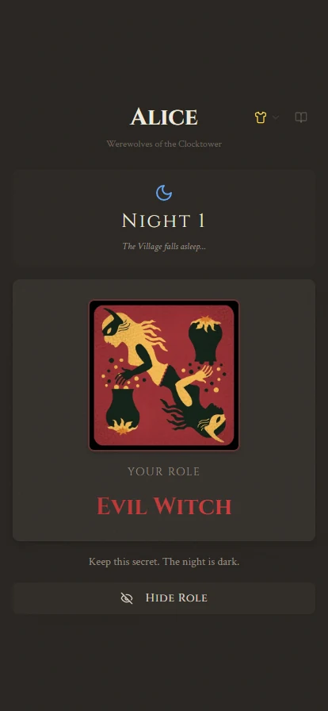
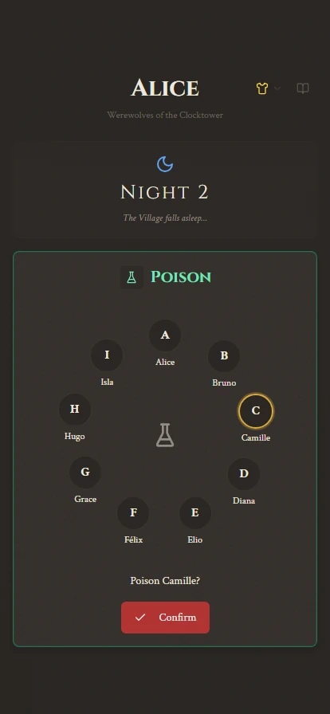

A game of secrets, accusations, and hidden loyalties, inspired by *Werewolf of the Miller's Hollow* and *Blood on the Clocktower*.

**Play together in person, with one computer and phones on the same Wi-Fi. No internet or accounts needed during the game.**

[Download the Windows game](https://github.com/AnJoMort0/WerewolvesOnTheClocktower_App/releases) · [Read the rulebook](#read-the-rulebook) · [See the game](#see-the-game)

| 🌕 **Narrate the village** | 🃏 **Keep secrets private** | 📡 **Play fully offline** |
| :---: | :---: | :---: |
| Run the scripts, timers, deaths, and victory from one GM screen. | Send each player their character and actions on their own phone. | Host the whole game over local Wi-Fi, without accounts. |

☾　◆　☽

## What is the game?

Werewolves hide among the villagers. By day, players talk, share information, bluff, and accuse. At the Tribunal, the village hears accusations and votes. By night, everyone closes their eyes while the Game Master wakes characters to use their powers.

Dozens of characters bring information, poison, protection, love, copying, resurrection, and changing loyalties into the village. Death leaves players with a ghost's place in the story, rather than sending them away from the table.

The companion gives the Game Master a seating circle, random character assignments, night scripts, timers, status tracking, and private reveals. Players receive their cards and actions on their phones. The Game Master can also perform those actions and show a reveal on the computer when someone's phone is unavailable.

The interface and built-in rulebook are available in **English, European Portuguese, and French**. The game is still evolving through playtesting. A phone-to-computer LAN connection has been tested in person; rehearse your setup before hosting a large group.

## Read the rulebook

Read the rules in your language, explore the characters, or jump straight to the night scripts.

| Language | Full rulebook | Characters | Night scripts |
| --- | --- | --- | --- |
| English | [Read](https://anjomort0.github.io/WerewolvesOnTheClocktower_App/?lang=en) | [Characters](https://anjomort0.github.io/WerewolvesOnTheClocktower_App/?lang=en#rulebook-summary) | [Night scripts](https://anjomort0.github.io/WerewolvesOnTheClocktower_App/?lang=en#rulebook-night-script) |
| Français | [Lire](https://anjomort0.github.io/WerewolvesOnTheClocktower_App/?lang=fr) | [Personnages](https://anjomort0.github.io/WerewolvesOnTheClocktower_App/?lang=fr#rulebook-summary) | [Scripts de nuit](https://anjomort0.github.io/WerewolvesOnTheClocktower_App/?lang=fr#rulebook-night-script) |
| Português (Portugal) | [Ler](https://anjomort0.github.io/WerewolvesOnTheClocktower_App/?lang=pt) | [Personagens](https://anjomort0.github.io/WerewolvesOnTheClocktower_App/?lang=pt#rulebook-summary) | [Guiões noturnos](https://anjomort0.github.io/WerewolvesOnTheClocktower_App/?lang=pt#rulebook-night-script) |

☾　◆　☽

## See the game

**The Game Master's view**

Keep the whole village in view: seating, secret characters, night instructions, player status, and the controls that move the story forward.

**The players' view**

Your phone holds your private character card. When the GM opens your action, choose from the player circle and confirm your target. Information and actions are mirrored on the GM screen, so a missing phone does not stop the game.

  
  &nbsp;
  

*Actual screens from a nine-player demonstration game, shown in English. Character artwork and interface language can be changed in the app.*

## What you need

- **At least 8 players and one Game Master.**
- **One Windows computer** to run the companion. Keep it powered and awake throughout the game.
- **A Wi-Fi network** shared by the computer and phones. The router does not need internet access. A suitable hotspot can work too.
- **Phones with a browser** for private cards and actions. Nothing needs to be installed on them. If someone has no phone, the GM can handle their actions and show their information discreetly.
- A space where everyone can hear the GM and close their eyes during the night.

The Windows instructions below need no terminal commands. Internet is needed to download the game. Afterwards, the prepared game runs offline.

## Download and launch on Windows

### Ready-to-play ZIP

1. Open [Game downloads](https://github.com/AnJoMort0/WerewolvesOnTheClocktower_App/releases).
2. Download **`WerewolvesOnTheClocktower-LAN-Windows-x64.zip`** from the release's **Assets** section. It includes everything needed, including Node.js.
3. In File Explorer, right-click the downloaded ZIP and choose **Extract All…**. Choose a folder you can find again, such as **Documents → Werewolves on the Clocktower**.
4. Open the extracted folder and double-click **`Start LAN Game.cmd`**..
5. A server window appears and your browser opens the game. **Leave the server window open.** Closing it disconnects everyone.

Do not launch from inside the ZIP or double-click `index.html`. Extract the entire package first. The Windows x64 package is intended for Windows computers that can run x64 applications.

## Start a game and connect the phones

1. Connect the computer and every phone to the **same Wi-Fi**. Avoid guest Wi-Fi that prevents devices from communicating.
2. Launch **Start LAN Game**. If Windows Firewall asks, allow Node on your **private network** so the phones can reach the computer.
3. The GM's browser opens at **`http://localhost:8080`**. Look for **“Offline LAN · same network”** on the home screen.
4. Choose your language and click **Start LAN game**.
5. Open the room's **QR code**. Each player scans it, opens the link in their browser, and enters their name. Players can also open the **Players** address printed in the server window and enter the room code.
6. Confirm that everyone appears in the GM lobby. Arrange the seating circle to match where people are sitting.
7. Choose whether to enable advanced characters, then click **Confirm & Assign Roles**. Review the cards and change them if needed.
8. Click **Send Roles to Players**. Everyone checks their own card privately. You are ready to begin.

**The computer hosts the game even when internet is disconnected. Keep it awake, connected to Wi-Fi, and running.** Phones must use the QR link or the printed network address; `localhost` on a phone means the phone itself.

## Run the village

The GM should read the built-in **Rulebook** before the first session and keep it nearby. It explains the full rules, characters, first-night setup, death, and unusual interactions. Players can open it from the home screen or by clicking a character card.

1. **Introduce the rules.** Explain the village's goals, secrecy, discussion, Tribunal, and what happens after death. Read each unfamiliar character's instructions.
2. **Follow the first-night script.** Ask everyone to close their eyes and wake only the characters named by the script. The first night has its own setup and protections; follow its instructions rather than jumping straight to a hunt.
3. **Run the day.** Let the village discuss, trade information, and bluff. Use the timer to keep the conversation moving.
4. **Hold the Tribunal.** Follow its instructions for accusations, defence, voting, and executions.
5. **Run the next night.** Follow the current night script, open phone actions or information reveals when prompted, approve actions that require the GM, and record their consequences. Tick completed script lines to track progress.
6. **Repeat until a winning condition is met.** Review the companion's victory prompt, or use the GM's manual game-over control when appropriate.

The companion assists the narrator; the GM still explains the rules, manages discussion, and resolves decisions. Players should keep their game tab open and their private information out of other people's view.

### Playing when a phone is unavailable

The GM can select targets, reveal information, and approve actions from the computer. GM modals use a fully opaque background, allowing the GM to show that modal without revealing the room behind it. Show private information only to its intended recipient, and turn the screen away before closing the modal.

## Finish, pause, or resume

- **Finish normally:** confirm game over, then press **Ctrl+C** in the server window when everyone is done.
- **Before a break:** bookmark or save the GM room's browser address. Keep the same browser profile and game folder.
- **Resume after stopping:** double-click the launcher again and reopen the saved GM room address. Clicking **Start LAN game** creates a new room.
- **Reconnect a phone:** return to its game tab or refresh it. If you need to join again, use the same room and the same name to recover the existing player.
- **Keep saved games:** do not delete the game folder or its hidden `.lan` folder. Local saves and GM browser state support recovery, but a sudden shutdown can lose the latest unsaved changes.

## If something does not work

| Problem | Try this |
| --- | --- |
| Double-clicking does not start the game | Extract the whole ZIP first. Open the folder containing **Start LAN Game**, rather than an individual file inside the ZIP. |
| First setup cannot finish | Reconnect internet, keep the folder in a writable location such as Documents, and launch again. Read the message left in the server window. |
| The browser does not open | Type the **GM** address printed in the server window into the computer's browser. |
| A phone cannot open the link | Check that the server window is still open, both devices use the same Wi-Fi, and the computer firewall allows Node. Temporarily disconnect VPNs. |
| Every phone fails but the computer works | Your Wi-Fi may isolate devices. Use a private network instead of guest Wi-Fi, or ask the network owner about client/AP isolation. |
| The QR link points to the wrong network | A VPN or virtual network adapter may have been selected. See the network-address instructions in the guide linked below. |
| The game stops when the computer sleeps | Disable sleep for the session and keep the computer plugged in. |
| A phone loses its connection when locked | Unlock it, return to the game tab, and refresh if necessary. Keep it on Wi-Fi. |

For detailed explanations of network settings, another GM device, saved games, and recovery, see the [offline LAN guide](offline-lan.md).

## Art and credits

All character art is digitally hand-drawn by **L_PT_1463**. The collection combines original designs with reinterpretations of cards from *Werewolf of the Miller's Hollow*, informed by references from [Loups-Garous en Ligne](https://www.loups-garous-en-ligne.com/) and the [Wiki Loup-Garou](https://loupgarou.fandom.com/fr/wiki/Wiki_Loup-Garou).

The cards were redrawn in a unified personal style so the full cast feels like it belongs to the same village, while remaining familiar enough for players arriving from the classic game.

## AI transparency

The game design, character interactions, priorities, corrections, and creative direction are human-led. AI-assisted tools have been used during implementation: the application began as a Lovable project and later moved to a repository-based workflow with Codex assistance, allowing the maintainer to inspect, change, and correct the code directly.
